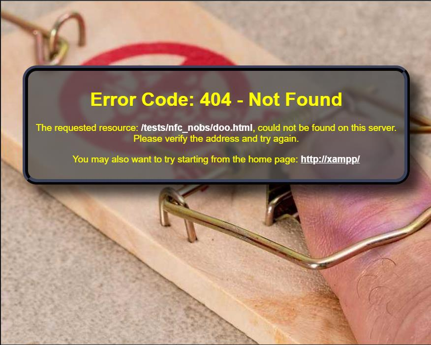
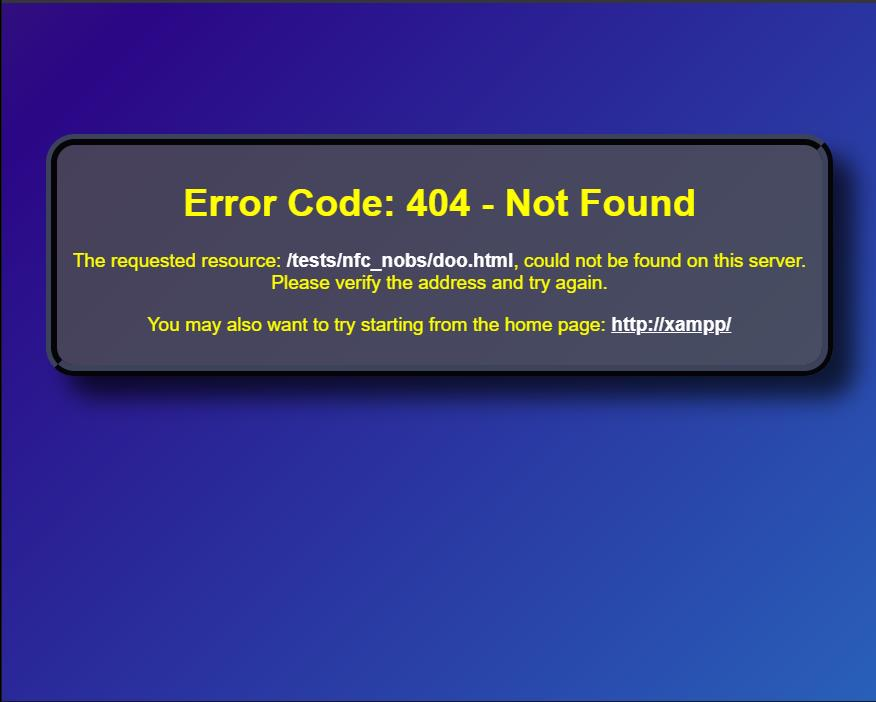

# PHP HTTP Error Page

This repository contains a "generic" HTTP error page. It's written in PHP/HTML and can be used for most any error page. 

## Features

* A single file for all 40X HTTP errors
* Two options for the page background -  
  * A background image, randomly selected from a "pool" of images.
  * A moving gradient of four random colors.
* All files (*except* `.htaccess`) are kept in a single folder
* Easy to copy to a website and use. You will only need to edit the `.htaccess` file
* An option to redirect automatically to a different page

Optional Page Backgrounds: 

<div align="center">
    <figure>
<!-- NOTE: When Github renders the images it will REMOVE the "margin", and ADD "max-width:100%" -->
        
        
        <br>
        <figcaption><strong>Random Image and Random Color Gradient Background</strong></figcaption>
    </figure>
</div>
<br>

# Installation

Two installation locations are possible. The first is a "local" location on an PC or NAS hosted HTTP server, and the second is on a "live" server.

## Local

For testing on a PC this will require the installation and setup of [XAMPP](https://www.apachefriends.org/index.html) or [MAMP](https://www.mamp.info). I prefer XAMPP.

Sometimes using a local web server can be frustrating because of the path where the *document root* is located. It would possible mean that you would have to place your repo folder(s) in a specific location. For example - `c:\xampp\htdocs`.

But that problem is easily fixed. Like Linux, Windows has the ability to create *folder junctions* (*i.e "symbolic links" in Linux*). So that means that your repositories (or other projects) can be located *anywhere* on the PC where your local web server is running. Just make a *junction* in your document root to access it via HTTP.

**NOTE**: Typically there are no SSL certificates in that type of installation, which is OK because this project does not require SSL.

### Testing

At the top of `/errpages/httperror.php` you find this - 

```php
// uncomment for testing
define('_DEBUG', false);
```

Change `false` to `true` and "debug" will be active. You can then load the page from the server and a `404` error will be simulated.

#### Additional Testing

The `/testhttperror.php` file can be used for testing error codes. First set `_DEBUG` to `false` in `/errpages/httperror.php`, and then open `/testhttperror.php` in your edtior - 

```php
<?php
// this script is for testing ./errpages/httperror.php, just 
// change the code below
$testcode = 401;
// this just proves we can overwrite $_SERVER
$_SERVER['HTTPS'] = 'on';
$_SERVER['SERVER_PORT'] = 443;
// get the code to httperror.php...
putenv("REDIRECT_STATUS={$testcode}");
// test!
require_once './errpages/httperror.php';
?>
```

Just change `$testcode` to the error code you want to test. Then point your browser to `testhttperror.php`.

### Folder Junctions

You might be familiar with a Linux *hard link*. The Window's equivalent is a *junction*. And they are particularly useful when keeping project folders organized in separate and possibly unrelated locations but you want to serve them with XAMPP(*or MAMP*) during development. 

Some alternatives to this method are - 

* Change XAMPP's document root path to the project's path, works for only one project at a time.
* Copy the project files into the document root after one or more edits. 

Neither of those methods are easy to work with. But junctions are a lot easier and since they look like folders you can have as many (*within the limits of Windows*) you need. 

#### Example

Let's say you're working on two separate projects and want to test them locally using XAMPP. And they're found in the following paths -

**Project A** - C:\Users\a-user\Documents\Projects\some-project 

**Project B** - D:\projects\web\customer-X\new-site

The following steps will create two project junctions :

1. Open a command-line window and go to `C:\xampp\htdocs`
2. Run the following commands - 
    a) `mklink /j c:\xampp\htdocs\projecta C:\Users\a-user\Documents\Projects\some-project`
    b) `mklink /j c:\xampp\htdocs\projectb D:\projects\web\customer-X\new-site`
    
**`mklink`** - command to create the junction
**`/j`** - tells mklink to create a folder junction.
**`c:\xampp\htdocs\projectb`** - a **nonexistent** folder, this is the junction
**`D:\projects\web\customer-X\new-site`** - this is the target of the junction

3. Then in your browser go to - 

    `http://`**`localhost`**`/projecta/index.html`
**--OR--**
    `http://`**`localhost`**`/projectb/index.html`

NOTE: The "junctions" are permanent until deleted from the `c:\xampp\htdocs` folder. You **must** use the `rmdir`(*Windows*) to remove the junction and **leave the files behind**.

### Required Editing

The repository `.htaccess` file *may* require some editing. This would depend on whether or not you're using the local web server and where you placed the repository files(*with or without junctions*).

```
# IMPORTANT!!! : Must remove or comment out below when 
# deploying on a live site! Or change this to match your
# local testing set up.
ErrorDocument 400 /tests/httperror/errpages/httperror.php
ErrorDocument 401 /tests/httperror/errpages/httperror.php
ErrorDocument 403 /tests/httperror/errpages/httperror.php
ErrorDocument 404 /tests/httperror/errpages/httperror.php
ErrorDocument 405 /tests/httperror/errpages/httperror.php
```

This part `/tests/httperror` will need editing depending on how you set up the local server.

## It Lives!

Most internet web servers have a *common* location for website files. It's typically located at `/home/$USER/public_html`. Where **`$USER`** is the *user* that owns the `public_html` folder. Depending on your server's particular configuration that folder may be named differently or in a different location.

1) Copy the `/errpages` folder and its **contents** to `/home/$USER/public_html` (or its equivalent). You now have `/home/$USER/public_html/errpages`.
2) Open the `.htaccess` file in the repository.
3) **Copy** this section out of it - 
```
# PHP error page, edit as needed for a "live" site
###ErrorDocument 400 /errpages/httperror.php
###ErrorDocument 401 /errpages/httperror.php
###ErrorDocument 403 /errpages/httperror.php
###ErrorDocument 404 /errpages/httperror.php
###ErrorDocument 405 /errpages/httperror.php
```
4) Open your server's `.htaccess` file. It will be located in the `public_html` folder. It is possible that your server does **not** have an `.htaccess`. If that happens create a new one.

5) **Paste** the lines from step 3 into your server's `htaccess` file. It should go near the top of the file, but it's not necessary to make it the first thing. Then edit what you pasted to look like this (comment `###` removed) - 
```
# PHP error page, edit as needed for a "live" site
ErrorDocument 400 /errpages/httperror.php
ErrorDocument 401 /errpages/httperror.php
ErrorDocument 403 /errpages/httperror.php
ErrorDocument 404 /errpages/httperror.php
ErrorDocument 405 /errpages/httperror.php
```

To see the error page working open your browser and go to - 
`http://your_server/`**`not_here`**

You should see a "400" error page.

## Changing Backgrounds

Near the top of the `httperror.php` file:

```
// can't have both!!
define('_IMG_POOL', false);
define('_GRADIENT', true);
```

Set `_IMG_POOL` or `_GRADIENT` to `true` to select that background type.

# Development Notes

* Development Environment:
  * Host OS: Windows
  * Local HTTP Server: XAMPP
    * PHP 5.6 

---

